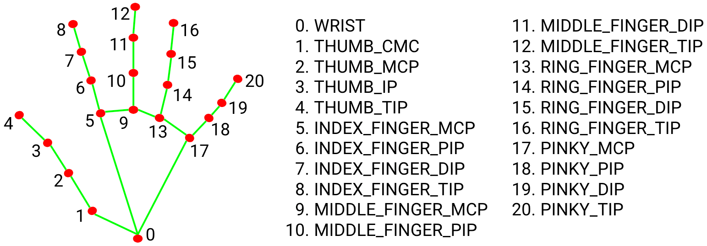
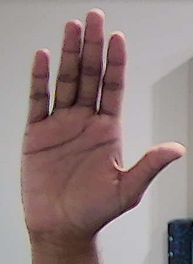
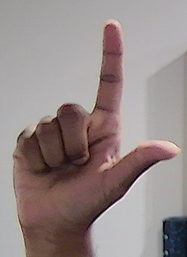
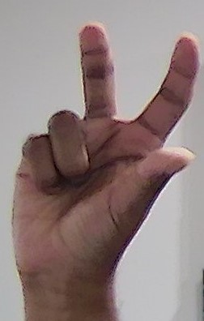
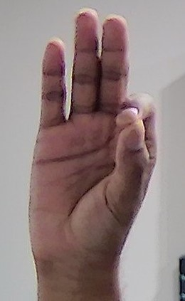
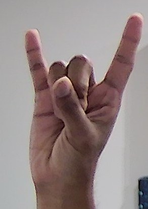
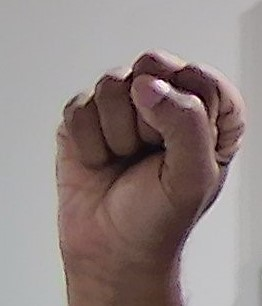

# Hand tracker in Python

This program tracks the users hands and relays its position, orientation and gesture information through websocket to listening clients - for example, a Unity client. 

## Installation

First, install the required packages using the `requirement.txt` file. Then, start the `server.py` script which starts a websocket server. Finally, start the `handPose.py` file. This will start your webcam and tracks your hand position, finger angles and also runs gesture recognition.

## Output

The hand tracking script produces a array output with 23 elements. The description of the elements are as follows:

- Index 0 - 2 : Relative (X,Y,Z) Position of Index Finger MCP w.r.t wrist
- Index 3 - 5 : Relative (X,Y,Z) Position of Ring Finger MCP w.r.t wrist
- Index 6 - 8 : Image coordinates (X,Y,Z) of wrist in the frame
- Index 9 - 22 : Finger angles in the following order - Index_MCP, Index_PIP, Index_DIP, Middle_MCP, Middle_PIP, Middle_PIP, Pinky_MCP, Pinky_DIP, Pinky_PIP, Ring_MCP, Ring_DIP, Ring_PIP, Thumb_MCP, Thumb_IP
- Index 23 : Class number of gesture recognized

This image shows the positon and index of joint names listed above:

## Gestures recognized

Six gesture classes are recognized by the script. The gesture and the class number are listed here:

Gesture ID | Gesture | Usecase
:---------:|:--------:|:--------:
 | 0 | Rest
 | 1 | Click
 | 2 | Rotate
 | 3 | Pinch
 | 4 | Move camera
 | 5 | Grab